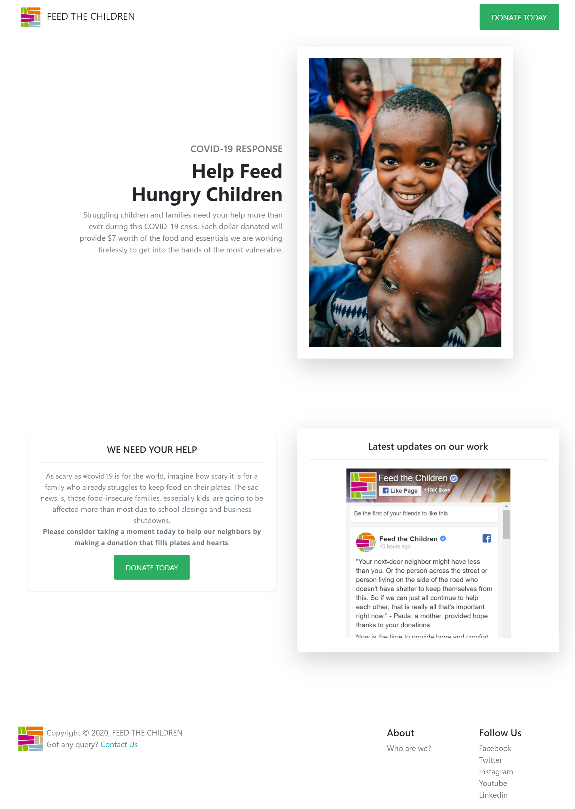

# donation-landing-page
In the current marketing environment, a landing page is one of your most essential assets, and creating a high-converting nonprofit donation landing page has become a science. It involves mixing the right elements to create an experience visitors can’t resist.

So I made a simple landing page using donately and bootstrap with simple user interface focusing on  visibility, headline and call to action. 

You can view the live demo at - https://whoisproshanta.github.io/donation-landing-page/

